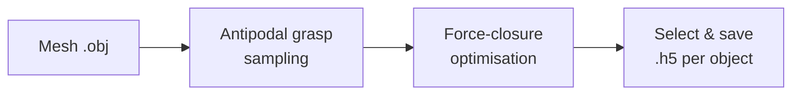

# DG16M Dataset Generation

This repository generates the **DG16M** dual-arm grasp dataset. Given a set
of object meshes, it samples antipodal grasps (using a modified Dex-Net
pipeline) and evaluates them with a force-closure (FC) convex optimisation.



## Directory layout

```
.
├── main.py                          # CLI entry point
├── config.yaml                      # All configuration
├── core/
│   └── scripts/
│       ├── generate_dg16m.py        # Pipeline orchestration
│       ├── dexnet/                  # Dex-Net framework (vendored, modified)
│       │   ├── api.py
│       │   └── grasping/
│       │       ├── grasp_sampler.py
│       │       └── gripper.py
│       ├── grasp_optimization/      # FC optimisation
│       │   ├── force_closure_optmization.py
│       │   └── check_contact_points_parallel.py
│       └── DA2_tools/               # ACRONYM utilities
├── core/meshpy/                     # Vendored mesh I/O (meshpy)
├── grippers/                        # Gripper models (robotiq_85)
├── docs/                            # This documentation
└── visualize_grasps.ipynb           # Jupyter notebook for visualisation
```

## Key concepts

- **Antipodal grasp** — a grasp where the two gripper jaws contact the object
  on approximately opposite sides, with contact normals roughly collinear.
- **Force closure** — a grasp is in force closure if it can resist arbitrary
  external wrenches through contact forces alone. We use the residual
  optimisation approach (minimise $\|Gf + w_\text{ext}\|$) with friction-cone
  constraints.
- **Dual-arm grasp** — each grasp consists of two independent gripper poses
  (left arm / right arm), each with two contact points (four contacts total).
