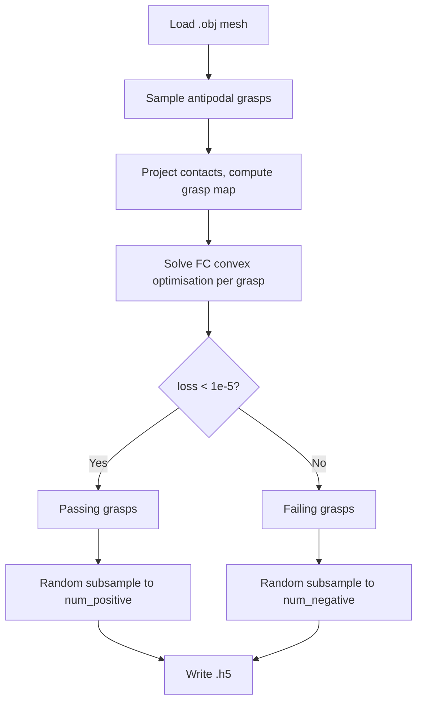

# Pipeline walkthrough

The entire pipeline is orchestrated by `generate_dg16m.f()`.



## 1. Load mesh

The mesh is read from the `.obj` file using meshpy's `ObjFile`. The raw
mesh is wrapped in a `GraspableObject3D` for Dex-Net compatibility.

## 2. Sample antipodal grasps

A `MeshAntipodalGraspSampler` is configured and run. It:

- Samples random surface points on the mesh.
- For each surface point, searches for an approximately antipodal contact
  on the opposite side (contact normals roughly collinear and opposite).
- Assembles valid single-jaw contacts into dual-arm grasp pairs.
- Removes pairs where the two contacts are too close.
- Returns `num_sampled_grasps` candidate grasps (or fewer if not enough
  valid pairs are found).

## 3. Build contact data

Each grasp consists of two gripper poses (left / right arm). The four
contact points are extracted and stored as arrays of shape `(N, 4, 3)`.

## 4. Force-closure optimisation

For each of the N sampled grasps:

1. The four contact points are projected onto the mesh surface to obtain
   the face normals (inward-pointing).
2. A **grasp map** *G* is constructed from the contact positions and
   normals.
3. A convex optimisation problem is solved:

   ```
   minimise    ‖ G f + w_ext ‖
   subject to  ‖ f_i ‖ ≤ 70 N
                ‖ (f_x, f_y) ‖ ≤ μ · f_z              (friction cone)
   ```

   where *μ* is `friction_coeff` and *w_ext* is the gravity wrench
   (`10 × object_mass` in the chosen direction).

4. If the grasp map is rank-deficient (rank < 6), the grasp is
   immediately marked as failing (loss = 1000).

The FC optimisation runs in parallel across `num_workers` processes.

## 5. Classify grasps

A grasp **passes** FC if the optimal residual loss < `1e-5`. Otherwise it
**fails**.

| Category | Criterion | Number kept |
|---|---|---|
| Passing | loss < 1e-5 | up to `num_positive` (random subsample) |
| Failing | loss ≥ 1e-5 | up to `num_negative` (random subsample from loss > 0.5) |

If fewer than the requested number exist, all available grasps are kept.

## 6. Save HDF5

The selected grasps are written to
`<SAVE_PATH>/<mesh_filename_without_ext>.h5`.

Passing grasps occupy indices `0 … num_positive-1`, followed by failing
grasps at indices `num_positive … num_positive+num_negative-1`.
